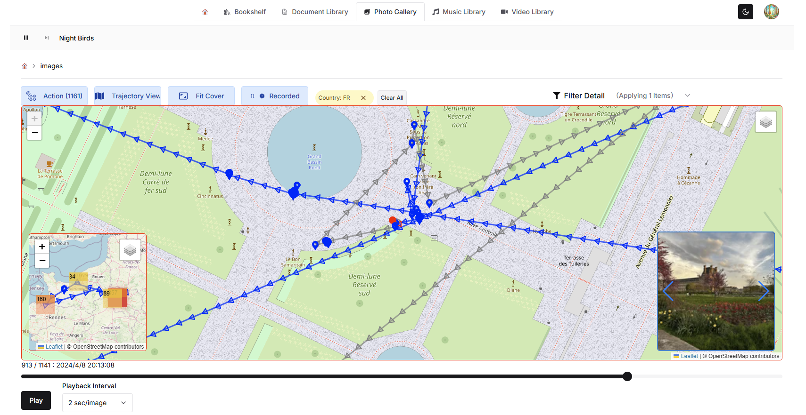
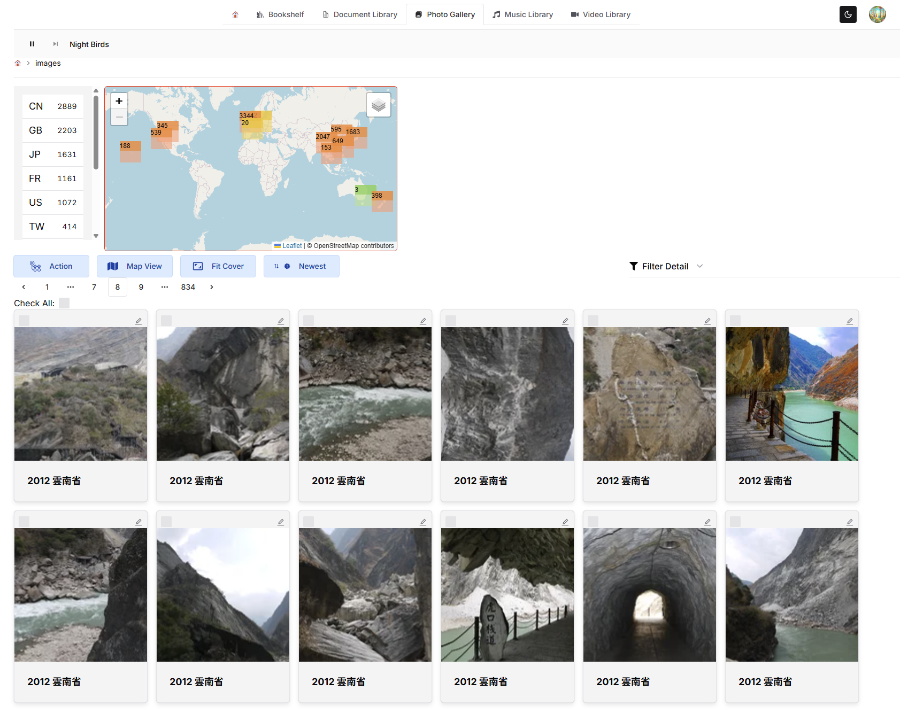
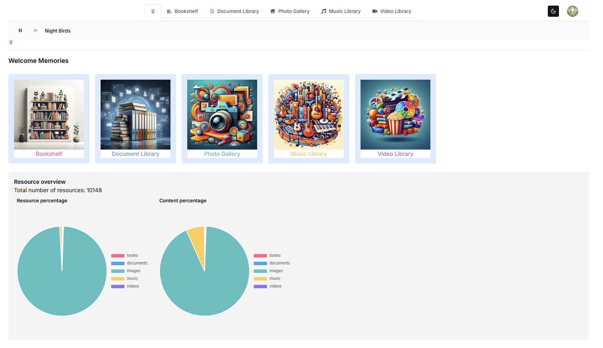
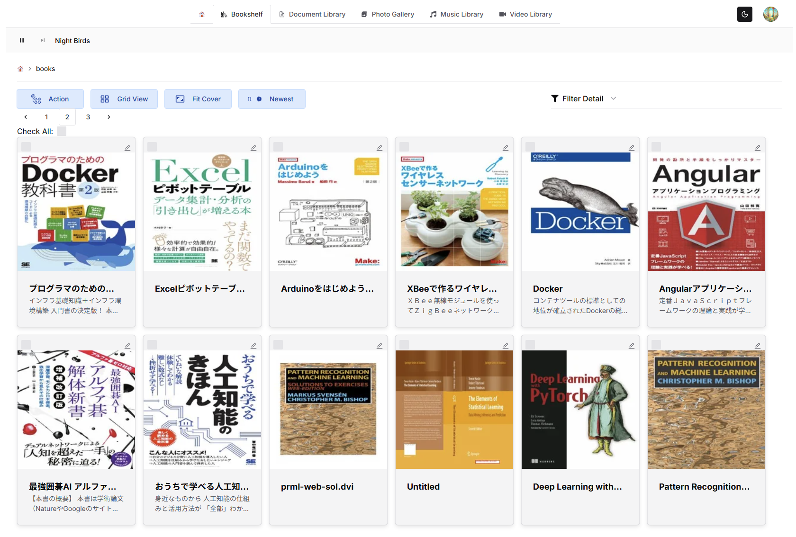
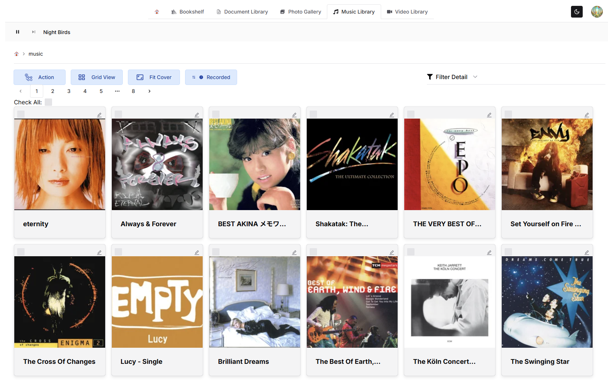
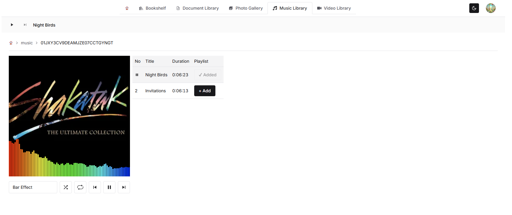
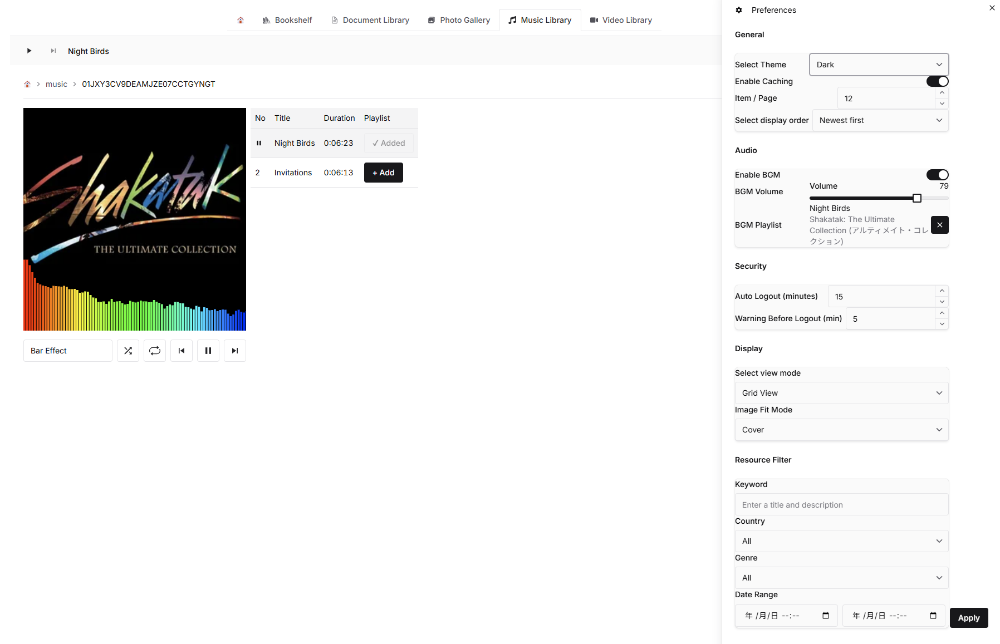

# Memories

**Memories** is a flexible and user-centric resource visualization platform designed to help users explore, filter, and relive their recorded experiences.  
Whether you're navigating a trajectory map, browsing through media-rich slideshows, or refining your preferences, Memories empowers you to rediscover meaningful moments with clarity and control.

## Features

- 🗺️ **Trajectory Mapping** — Visualize spatial-temporal data with customizable zoom modes and playback controls.
- 🎞️ **Slideshow Viewer** — Browse resources with thumbnails, metadata, and intuitive navigation.
- 🔍 **Advanced Filtering** — Search by keyword, country, genre, and date range with precise control.
- ⚙️ **User Preferences** — Tailor your experience with theme selection, caching options, and display settings.
- 🧠 **Smart State Management** — Built with scalable architecture using Zustand and TanStack Query for performance and maintainability.

## Philosophy

Memories is built on the belief that data should serve the user—not the other way around.  
Every component is designed to be modular, responsive, and empathetic to the user's intent, making it ideal for personal archives, creative exploration, or analytical storytelling.

## 📸 Screenshots

| View                                                                                 | Preview                                                     |
| ------------------------------------------------------------------------------------ | ----------------------------------------------------------- |
| **Trajectory View** — Explore spatial-temporal paths with zoom and playback controls |    |
| **Map View** — Visualize resource locations with clustering and hover effects        |           |
| **Dashboard** — Overview of recent activity and resource stats                       |         |
| **Bookshelf** — Browse resources in a grid layout with thumbnails and metadata       |         |
| **Music Library** — Filter and explore audio resources by genre and date             |      |
| **Music Player** — Play and preview audio with waveform and metadata                 |       |
| **Preferences Panel** — Customize theme, caching, zoom behavior, and more            |  |

## 🚀 Getting Started

To run Memories locally using Docker:

1. Create a working directory

```bash
   mkdir memories
   cd memories
```

2. Clone the frontend and storage server

```bash
   git clone https://github.com/forestlaw77/memories-frontend.git
   git clone https://github.com/forestlaw77/memories-storage.git
```

3. Set up docker-compose.yml

   Create a docker-compose.yml file in the root of your memories directory:

```Yml
services:
  frontend:
    build:
      context: ./memories-frontend
      dockerfile: Dockerfile.dev
    container_name: memories-frontend
    image: forestlaw/memories-frontend
    volumes:
      - ./memories-frontend:/src
      - ./memories-frontend/.vscode-server:/root/.vscode-server
    ports:
      - "8080:8080"
    networks:
      - memories-network
    command: pnpm dev
    user: "${UID}:${GID}"

  storage:
    build:
      context: ./memories-storage
      dockerfile: Dockerfile.dev
    container_name: memories-storage
    image: forestlaw/memories-storage
    volumes:
      - ./memories-storage/local_storage:/local_storage
      - ./memories-storage:/src
      - ./memories-storage/.vscode-server:/root/.vscode-server
    ports:
      - "4001:4001"
    networks:
      - memories-network
    environment:
      - STORAGE_DIRECTORY=/local_storage
    user: "${UID}:${GID}"

networks:
  memories-network:
    driver: bridge
```

4. Configure environment variables

Each project requires a `.env.local` the for runtime configuration.

You can start by copying the provided `dot-env.example` files:

```bash
# Copy template files to create your local environment configs
cp memories-frontend/dot-env.example memories-frontend/.env.local
cp memories-storage/dot-env.example memories-storage/.env.local
```

> 🛡️ Note: We use dot_env.example instead of .env.example to avoid accidental inclusion in version control.
> Make sure .env.local is listed in .gitignore and never committed.

Then fill in the required values:

- **Frontend** (`memories-frontend/.env.local`)  
  Includes API keys, OAuth credentials and backend URLs.
- **Storage** (`memories-storage/.env.local`)  
  Includes storage path, server port, and OAuth credentials for token verification.

> 🔐 Make sure both projects use the same `GOOGLE_CLIENT_ID` and `GOOGLE_CLIENT_SECRET` to ensure consistent authentication.

5. Start the development environment

```bash
   docker compose up
```

Then access the frontend at http://localhost:8080
The storage server will be available at http://localhost:4001

✅ Notes

- You can mount sample data into `memories-storage/local_storage` to test resource loading.
- If you're using VS Code with Remote Containers, the `.vscode-server` volume ensures persistent extensions.
- UID/GID mapping ensures file permissions match your host system.
- Environment variables are loaded from `.env.local` in each project. See `dot-env.example` for reference.
  > 🛡️ Environment variables are validated automatically in CI using `dot-env.example` and a generated `dot-env.ci`.  
  > To set up your local environment, copy `dot-env.example` to `.env.local` and fill in the values manually.

### 🧪 Local Mode (No Authentication)

This mode is designed for:

- 🧑‍💻 Local development and testing
- 👤 Personal use without authentication setup
- 🚀 Quick onboarding for new contributors

To run Memories locally without authentication:

1. Copy `memories-frontend/dot-env.example` to `memories-frontend/.env.local`
2. Set `SKIP_AUTH=true`
3. Set `NEXT_PUBLIC_SKIP_AUTH=true`
4. Copy `memories-storage/dot-env.example` to `memories-storage/.env.local`
5. Set `SKIP_AUTH=true`
6. Run `docker compose up`
7. You will be logged in automatically as a guest user

> ✅ Guest users are automatically registered on the backend if they don't exist.  
> ⚠️ Do not use SKIP_AUTH in production environments.  
> 🛡️ Guest users have limited access and data may not persist across sessions.

## 🔐 Environment Variable Security

Do not include .env.local or other .env files in your Docker images.
These files may contain sensitive credentials (e.g. OAuth secrets, API keys).
If bundled into the image, they can be extracted by anyone with access to the image.

✅ Recommended Practices

- Add .env\* to .dockerignore to prevent accidental inclusion:

```Txt
.env
.env.local
.env.production
```

- Inject secrets at runtime using docker run -e or --env-file:

```Bash
docker run -e NEXTAUTH_SECRET=your-secret -e BACKEND_API_URL=https://api.example.com your-image
```

- For production deployments, use a secrets manager (e.g. AWS Secrets Manager, HashiCorp Vault)

💡 Why this matters

> Docker images are portable and often shared.
> Including secrets in the image makes them accessible to anyone who can pull or inspect it.
> Keeping secrets out of the image ensures your credentials remain secure.

## 🧰 Tech Stack

| Layer            | Technology                  | Purpose                                      |
| ---------------- | --------------------------- | -------------------------------------------- |
| Framework        | Next.js                     | App routing, SSR/SSG, deployment flexibility |
| UI Library       | Chakra UI                   | Accessible, theme-aware component styling    |
| Map Engine       | Leaflet                     | Lightweight interactive maps                 |
| Slideshow        | Swiper                      | Responsive, touch-friendly carousel viewer   |
| State Management | Zustand                     | Scalable local/global state                  |
| Data Fetching    | TanStack Query              | Async caching, background updates            |
| Styling          | CSS Modules + Chakra tokens | Scoped styles and design consistency         |
| Icons            | React Icons                 | Visual cues and UI clarity                   |

## 🧪 Development Philosophy

Memories is built with:

- Modularity — Each feature is encapsulated for maintainability and reuse.
- Empathy — UI and UX are designed to anticipate user needs and reduce friction.
- Performance — Minimal re-renders, smart caching, and lazy loading where needed.
- Scalability — Clean separation of concerns and extensible architecture.

## 📦 Folder Structure (Simplified)

```bash
src/
├── app/               # Next.js App Router structure
│   ├── [resourceType] # Dynamic routes
│   ├── api/           # Route handlers
│   ├── login/         # Auth page
│   └── page.tsx       # Root component
├── assets/            # Icons, images, and static files
├── components/        # Reusable UI elements
├── config/            # Runtime configuration
├── context/           # React context providers
├── features/          # Domain-specific modules (map, slideshow, settings)
├── hooks/             # Custom logic and state accessors
├── libs/              # External integrations and wrappers
├── public/            # Static assets served by Next.js
├── screenshots/       # UI snapshots and design references
├── scripts/           # Dev and build automation
├── styles/            # Global and modular styles
├── types/             # Shared type definitions
└── utils/             # Shared helpers and constants
```

## ✅ Next Steps

- [ ] Add persistent user preferences via localStorage or IndexedDB
- [ ] Implement keyboard shortcuts for slideshow navigation
- [ ] Optimize map rendering for large datasets
- [ ] Internationalization (i18n) support

## 🧭 Usage

After starting the development server:

- Access the app at http://localhost:8080
- Use the sidebar to filter resources by keyword, country, genre, or date
- Switch between Map View and Slideshow View using the top navigation
- Customize preferences via the settings panel (theme, zoom mode, caching behavior)

## 🤝 Contributing

Contributions are welcome! Here's how to get started:

- Fork the repository
- Create a new branch: git checkout -b feature/your-feature-name
- Commit your changes: git commit -m "Add your feature"
- Push to your fork: git push origin feature/your-feature-name
- Open a pull request
  Please follow the Code of Conduct and check the Contribution Guidelines before submitting.

## 📄 License

> Note: This project uses a custom license based on MIT.  
> SPDX identifier: `LicenseRef-Tsutomu-MIT-NC`

This software is dual-licensed:

- **Non-commercial use**: Licensed under the MIT License (with Non-Commercial restriction) — see [LICENSE-NC.txt](LICENSE-NC.txt)
- **Commercial use**: Requires a separate commercial license — see [LICENSE-COMMERCIAL.txt](LICENSE-COMMERCIAL.txt) and contact the author.

You may choose the license that best fits your use case.  
🔒 A commercial license is an important way to help us keep developing and to ensure you can use the software with confidence.  
📧 Contact: forestlaw.me+github@gmail.com

### ライセンス（日本語）

本ソフトウェアはデュアルライセンスです。

- **非商用利用**: 非商用 MIT ライセンス（[LICENSE-NC.txt](LICENSE-NC.txt)）の条件で利用可能
- **商用利用**: 別途商用ライセンスが必要（[LICENSE-COMMERCIAL.txt](LICENSE-COMMERCIAL.txt) を参照し、作者に連絡）

用途に応じて、適切なライセンスを選択してください。  
🔒 商用ライセンスは、みなさまに安心して使っていただくため、そして開発を続けるための大切な仕組みです。  
📧 Contact: forestlaw.me+github@gmail.com

## 🧑‍💻 Author

Tsutomu Funada
Frontend engineer & Backend engineer & UX designer  
📧 Contact: forestlaw.me+github@gmail.com
